<div align="center">
      
  
  <h3>🌐 <a href="https://n-zik.vercel.app/">Official Website</a></h3>
  <p>
    <b>N-Zik</b> is a multilingual fork of <a href="https://github.com/knighthat/Kreate">Kreate</a>, 
    built with performance improvements, UI/UX refinement, bug fixes, and new features in mind with long-term support.
  </p>
  <p>
    <strong>N-Zik</strong> may not yet be as stable as the original 
    <a href="https://github.com/knighthat/Kreate">Kreate</a>, so feel free to use it or other 
    solid alternatives like <a href="https://github.com/MetrolistGroup/Metrolist">Metrolist</a>, 
    <a href="https://github.com/vivizzz007/vivi-music">VIVI Music</a>, or 
    <a href="https://github.com/fast4x/RiPlay">RiPlay</a> if you need a more mature option (RiPlay doesn't have download / cache feature).
  </p>
  <p>
    <strong>N-Zik</strong> is a side project I originally built for myself and friends, not chasing glory. 
    It's grown a bit since then, which is cool.
  </p>
  <p>
    I use generative AI to assist with code, structured with the 
    <a href="https://github.com/bmad-code-org/BMAD-METHOD">BMAD Method</a>, 
    but everything gets reviewed and tested before it's pushed. I'm not shipping blind.
  </p>
  <p>
    If AI-assisted development isn't your thing, no hard feelings, 
    there are plenty of great alternatives.
  </p>
</div>

  <br>
  
</div>

<div align="center">
  
  
  
 <br><br>

[](https://devglobe.app/projects/n-zik?utm_source=badge&utm_medium=embed)

[](https://crowdin.com/project/N-Zik) [](https://www.gnu.org/licenses/gpl-3.0)
[](https://www.codefactor.io/repository/github/N-Zik-Group/n-zik)

</div>

# 📲 Installation

[](https://github.com/N-Zik-Group/N-Zik/releases/latest)
[](https://github.com/N-Zik-Group/N-Zik/releases?q=&type=prerelease)
[](https://f-droid.org/packages/com.nevar.nzik.foss/)
[](https://apt.izzysoft.de/fdroid/index/apk/com.nevar.nzik.foss?repo=main)
[](https://www.openapk.net/n-zik/com.nevar.nzik.foss/)
[](https://www.androidfreeware.net/download-n-zik-apk.html)
[](<https://apps.obtainium.imranr.dev/redirect?r=obtainium://app/%7B%22id%22%3A%22com.nevar.nzik.foss%22%2C%22url%22%3A%22https%3A%2F%2Fgithub.com%2FN-Zik-Group%2FN-Zik%22%2C%22author%22%3A%22N-Zik-Group%22%2C%22name%22%3A%22N-Zik%20(FOSS)%22%2C%22preferredApkIndex%22%3A0%2C%22additionalSettings%22%3A%22%7B%5C%22includePrereleases%5C%22%3Afalse%2C%5C%22fallbackToOlderReleases%5C%22%3Atrue%2C%5C%22filterReleaseTitlesByRegEx%5C%22%3A%5C%22%5C%22%2C%5C%22filterReleaseNotesByRegEx%5C%22%3A%5C%22%5C%22%2C%5C%22verifyLatestTag%5C%22%3Afalse%2C%5C%22sortMethodChoice%5C%22%3A%5C%22date%5C%22%2C%5C%22useLatestAssetDateAsReleaseDate%5C%22%3Afalse%2C%5C%22releaseTitleAsVersion%5C%22%3Afalse%2C%5C%22trackOnly%5C%22%3Afalse%2C%5C%22versionExtractionRegEx%5C%22%3A%5C%22%5C%22%2C%5C%22matchGroupToUse%5C%22%3A%5C%22%5C%22%2C%5C%22versionDetection%5C%22%3Atrue%2C%5C%22releaseDateAsVersion%5C%22%3Afalse%2C%5C%22useVersionCodeAsOSVersion%5C%22%3Afalse%2C%5C%22apkFilterRegEx%5C%22%3A%5C%22N-Zik-foss%5C%5C%5C%5C.apk%5C%22%2C%5C%22invertAPKFilter%5C%22%3Afalse%2C%5C%22autoApkFilterByArch%5C%22%3Atrue%2C%5C%22appName%5C%22%3A%5C%22N-Zik%20(FOSS)%5C%22%2C%5C%22appAuthor%5C%22%3A%5C%22N-Zik-Group%5C%22%2C%5C%22shizukuPretendToBeGooglePlay%5C%22%3Afalse%2C%5C%22allowInsecure%5C%22%3Afalse%2C%5C%22exemptFromBackgroundUpdates%5C%22%3Afalse%2C%5C%22skipUpdateNotifications%5C%22%3Afalse%2C%5C%22about%5C%22%3A%5C%22N-Zik%20is%20a%20multilingual%20YouTube%20Music%20client%20built%20with%20performance%20improvements%2C%20UI%2FUX%20refinement%2C%20and%20new%20features.%5C%22%2C%5C%22refreshBeforeDownload%5C%22%3Afalse%2C%5C%22includeZips%5C%22%3Afalse%2C%5C%22zippedApkFilterRegEx%5C%22%3A%5C%22%5C%22%2C%5C%22includeTarballs%5C%22%3Afalse%2C%5C%22tarballedApkFilterRegEx%5C%22%3A%5C%22%5C%22%7D%22%2C%22overrideSource%22%3Anull%7D>)
[](https://appteka.store/search?q=N-Zik)

## 📦 Available Builds

- **Full** & **Beta** – Complete build with all components (`arm64-v8a`, 64-bit only).
- **Full32** & **Beta32** – Complete build with all components without FFmpeg (`armeabi-v7a` + `arm64-v8a`, 32-bit & 64-bit).
- **Minified** – Lightweight build, recommended for low-end devices (`arm64-v8a`, 64-bit only).
- **Minified32** – Lightweight build without FFmpeg (`armeabi-v7a` + `arm64-v8a`, 32-bit & 64-bit).
- **FOSS** (`com.nevar.nzik.foss`) – Full build without auto-updater, suitable for alternative stores (`arm64-v8a`, 64-bit only).
- **Dev** & **Dev32** – Development builds from latest commits, for testing only (`arm64-v8a` / `armeabi-v7a` + `arm64-v8a`).

> ℹ️ Standard builds (Full, Minified, Beta, FOSS, Dev) are 64-bit only because they bundle FFmpeg. The "32" builds (Full32, Minified32, Beta32, Dev32) drop FFmpeg, so they work on both 32-bit and 64-bit devices. (`armeabi-v7a` + `arm64-v8a`).

---

<div align="center">
<br><br>

<br>

<h1>⏳ Only <a href="https://keepandroidopen.org"></a> days remaining until Android Lockdown</h1>

Starting in **~~September 2026~~ January 2027** [See why the date changed here](https://keepandroidopen.org/en/faq/), Google will require **identity verification for all Android developers**, including those distributing applications **outside of Google Play**.

As a **Free and Open Source Software (FOSS)** project, **N‑Zik** and his **developer** opposes this requirement due to its impact on developer privacy, independent distribution, and software freedom.

📖 [Learn more](https://keepandroidopen.org) · ✍️ [Sign the petition](https://www.change.org/p/stop-google-from-limiting-apk-file-usage/)

</div>
<br>

<div align="center">

## 📚 Wiki

[](https://deepwiki.com/N-Zik-Group/N-Zik)

<br>

## 🌍 Community

Join the N-Zik Discord:

<a href="https://discord.gg/bneHC7QRje">
  
</a>

<br>

</div>

# 🎧 Features

- 🌍 **Multilingual Support** – Available in English, Italian, German, Russian, French, Spanish, Czech, Turkish, Romanian, and more. Contributions are always welcome!
- 🔊 **High Quality Audio** - Premium streaming quality is unlocked automatically - just connect your YouTube Music Premium account.
- 🎨 **Modern and Intuitive UI**
- 🌓 **UI Mode Toggle** – Switch between the **N-Zik** experience and the classic **ViMusic** interface.
- 💾 **Smart Offline Caching** – Automatically cache songs for offline playback with customizable cache limits.
- 📥 **Downloads** – Download individual tracks or entire playlists for permanent offline access, with a dedicated download quality (Auto/High/Low) and a batch "Update downloads" action.
- ▶️ **Background Playback** – Keep your music playing while using other apps.
- 🎵 **NZik Radio** – Algorithmic radio mode that auto-queues related songs based on the current track.
- 📊 **Listening Statistics** – Track your habits, favorite artists, and playback trends.
- ⬇️ **OTA Updates** – Receive automatic in-app updates without needing to reinstall manually.
- 🌈 **Audio Visualizer** – Enjoy real-time visual effects synchronized with your music.

> [!NOTE]
> 🎤 The audio visualizer requires **microphone permission** and must be enabled in the settings.

- 🕹️ **Discord Rich Presence** – Display your currently playing track directly on your Discord profile. An advanced mode adds custom text templates, activity type, up to 2 custom buttons, pause-presence, and a live interactive preview card.

<p align="left">
    <br>
  

</p>

- 📰 **Discovery** – Explore moods, genres, releases, and albums from your favorite artists, plus trending picks.
- 🔄 **Playlist Import & Export** – Easily back up, share, and restore playlists, you can import from Riplay, Spotify ([Exportify](https://exportify.net/)), Youtube Music and N-Zik
- ✍️ **Advanced Lyrics Support** – Fetch, display word by word, sync and unsync lyrics with smart fallback mechanisms, edit, and translate them in real-time via Google Translate with source language detection.
- 🎭 **Custom Themes** – Personalize the app with multiple theme options.
- ⏲️ **Sleep Timer** – Automatically stop playback after a configurable duration.
- 🎚️ **Advanced Audio Controls** – Adjust volume, playback speed, pitch, normalization, silence skipping, crossfade, volume boost, bass boost, and reverb.
- 🔍 **Song Recognition** – Identify songs playing around you via audio fingerprinting (Shazam-like).
- 🎤 **Voice Search** – Search for music using your voice with animated overlay.
- 📱 **On-Device Music** – Play local music files stored directly on your device.
- 📺 **Wide Platform Support** – Compatible with Android Auto, Android Automotive, Android TV, and YouTube video playback.
- 🪟 **Widgets** – New widgets for your home screen (Compact, Turntable, and Playlist).

<p align="left">
  <!-- Compact Widgets -->
   
   <br>
  <!-- Turntable Widgets -->
   
   <br>
  <!-- Playlist Widgets -->
   
  
</p>

- 📤 **Media Export** – Export cached or downloaded music to external storage with full metadata (title, artist, album, cover art, copyright, etc.) powered by FFmpeg. _(Note: Not available on 32-bit builds as they drop FFmpeg)_
- ✏️ **Metadata Editor** – Edit song metadata (title, artist, album, genre, year, cover art, and more) directly in-app. Supports both AAC and Opus codecs with automatic cover art embedding.
- ⚙️ **Settings & Database Auto-Backup** – Save, restore, and automatically back up your complete app configuration and database with customizable intervals, retention limits, and optional YouTube/Discord/Last.fm credential inclusion.
- 📡 **Offline First** – Enjoy your music library even without an internet connection.
- 🔁 **YouTube Sync** – Recommendations and profile-related content are synchronized from your YouTube account, plus a new two-way sync engine (experimental - currently enabled in debug/dev builds) that keeps your likes and synced items aligned between N-Zik and YouTube Music.
- 🔄 **Auto-Resume on Device Connect** – Automatically resume playback when Bluetooth headphones or speakers connect.
- 💾 **Persistent Queue** – Your queue is saved and restored across app sessions.
- 🔀 **Auto-fill Queue** – Automatically adds more songs when the queue is nearly empty.
- 🗑️ **Smart Trash** – Intelligent cleanup of songs based on listen count thresholds.
- 🔇 **Hidden Songs** – Hide or unhide songs from your library view.
- 👨‍👩‍👧‍👦 **Parental Control** – Block explicit content based on your settings.
- 🔗 **Invidious Integration** – Use an alternative YouTube frontend for streaming.
- 🌐 **Proxy Support** – Configurable proxy for YouTube API requests.
- 📶 **Network Quality Adaptation** – Adaptive streaming based on your connection quality.
- 📋 **Log Export** – Export app logs to a file, or copy them to the clipboard, for easy debugging and reporting.
- 👤 **Multi-Profile** – Switch between multiple isolated profiles (per-profile database and preferences) from the settings or the main-menu switcher.
- 👥 **Listen Together** – Join or host live listening sessions with other users via an 8-character code or invite link. Runs on Metrolist's [MetroServer](https://github.com/MetrolistGroup/metroserver) infrastructure (N-Zik is an officially supported host), and you can point it at your own custom server in the settings.
- 🎼 **Last.fm Integration** – Scrobble what you listen to: Now Playing, love/unlove, and configurable scrobbling options.
- 🧠 **MusicBrainz Insights** – Rich artist and album information, community data, and external links.
- 🚫 **Dislike System** – Dislike songs, artists, and albums to keep them out of your recommendations, with dedicated "Disliked" tabs.
- ⏯️ **Unified Player** – The full player and the mini-player are one experience; long-press the mini-player to open the in-app queue overlay.
- 🗓️ **Rewind** – Yearly and monthly listening recaps ("My Rewind"), auto-generated Rewind playlists, background music, and deck image export.
- 🚑 **Rescue Center** – Recover your app even if it won't start: a dedicated launcher shortcut exports and restores your database and settings.
- 🛠️ **Maintenance Screen** – Inspect the app state and its live subsystems, and export logs or crash reports.
- 🚪 **First-Launch Onboarding** – A guided 4-step flow (display name, playlist import, account setup).
- ⚡ **App Shortcuts** – Dynamically registered home-screen shortcuts (search, albums, artists, library, rescue).
- 📈 **Audio Bar** – A visual waveform seekbar for precise track navigation.

# 📷 Screenshots & Videos

<div align="center">
    
    
    
    
    
    
    
    
    
    <br><br>
    
    
    
    
    
    
    
    
    
    
    
    
    
    
    
    

</div>

# 🌐 Supported Languages

Thanks to all our amazing contributors!  
Here are the languages currently supported:

- 🇿🇦 **Afrikaans** — [HelloZebra1133](https://crowdin.com/profile/HelloZebra1133)
- 🇸🇦 **Arabic** — [ABS zarzis](https://crowdin.com/profile/abszar), [Ahmad Al Juwaisri](https://crowdin.com/profile/juwaisri)
- 🇦🇿 **Azerbaijani** — [Nizami Səmidov](https://crowdin.com/profile/nizamismidov4), [Notesuree](https://github.com/Notesuree)
- 🇧🇩 **Bangla** — [Ann Naser Nabil](https://github.com/AnnNaserNabil)
- 🇷🇺 **Bashkir** — [Shilave malay](https://crowdin.com/profile/Bash.boy)
- 🇪🇸 **Catalan** — [Adrià Martínez](https://crowdin.com/profile/marxally), [Aniol](https://crowdin.com/profile/aniol), [EMC_Translator](https://crowdin.com/profile/EMC_Translator)
- 🇨🇳 **Chinese (Simplified)** — [benhaotang](https://crowdin.com/profile/benhaotang), [SharkChan0622](https://github.com/SharkChan0622)
- 🇹🇼 **Chinese (Traditional)** — [YeeTW](https://github.com/yjcTW), [SharkChan0622](https://github.com/SharkChan0622)
- 🇨🇿 **Czech** — [ikanakova](https://github.com/ikanakova), [JZITNIK-github](https://github.com/JZITNIK-github)
- 🇩🇰 **Danish** — [cultcats](https://crowdin.com/profile/cultcats)
- 🇳🇱 **Dutch** — [BabyBenefactor](https://crowdin.com/profile/BabyBenefactor)
- 🇺🇸 **English** — [Alejandro Moctezuma](https://crowdin.com/profile/alejandromoc), [twistios](https://crowdin.com/profile/twistios), [Smk90](https://crowdin.com/profile/smk90), [CanIn](https://crowdin.com/profile/canin), [koliwan](https://crowdin.com/profile/koliwan), [Glich440](https://github.com/Glich440), [fast4x](https://github.com/fast4x)
- 🌍 **Esperanto** — [kefiiris](https://github.com/kefiiris)
- 🇪🇪 **Estonian** — [beez276](https://crowdin.com/profile/beez276)
- 🇵🇭 **Filipino** — [Clyde-Timonera](https://github.com/Clyde-Timonera)
- 🇫🇮 **Finnish** — [Smk90](https://crowdin.com/profile/smk90), [rikalaj](https://crowdin.com/profile/rikalaj)
- 🇫🇷 **French** — [Mickael81](https://crowdin.com/profile/mickael81), [esophagusdecency](https://crowdin.com/profile/esophagusdecency), [NEVARLeVrai](https://github.com/NEVARLeVrai)
- 🇪🇸 **Galician** — [zordor](https://crowdin.com/profile/zordor), [ninjum](https://crowdin.com/profile/ninjum)
- 🇩🇪 **German** — [twistqj](https://crowdin.com/profile/twistqj), [nitro4542](https://crowdin.com/profile/nitro4542), [twistios](https://crowdin.com/profile/twistios), [Eddisch](https://crowdin.com/profile/eddisch2010), and more...
- 🇬🇷 **Greek** — [Marinkas](https://github.com/Marinkas)
- 🇮🇱 **Hebrew** — [opcitgv](https://crowdin.com/profile/opcitgv), [TheCreeperDuck](https://crowdin.com/profile/thecreeperduck)
- 🇮🇳 **Hindi** — [NikunjKhangwal](https://crowdin.com/profile/nikunjkhangwal), [Sharunkumar](https://crowdin.com/profile/sharunkumar), [Th3-C0der](https://github.com/Th3-C0der)
- 🇭🇺 **Hungarian** — [Zan1456](https://crowdin.com/profile/Zan1456), [Ndvok](https://crowdin.com/profile/ndvok)
- 🇮🇹 **Italian** — [Fabio Iotti](https://crowdin.com/profile/bruce965), [CiccioDerole](https://crowdin.com/profile/CiccioDerole), [fast4x](https://github.com/fast4x)
- 🇮🇩 **Indonesian** — [luthfialfarabi](https://crowdin.com/profile/luthfialfarabi), [teddysulaimanGL](https://github.com/teddysulaimanGL)
- 🌐 **Interlingua** — [softinterlingua](https://github.com/softinterlingua)
- 🇯🇵 **Japanese** — [maboroshin](https://crowdin.com/profile/maboroshin), [Mid_Vur_Shaan](https://crowdin.com/profile/Mid_Vur_Shaan)
- 🇰🇷 **Korean** — [ZeroZero00](https://crowdin.com/profile/ZeroZero00), [TsyQax](https://crowdin.com/profile/TsyQax)
- 🇳🇴 **Norwegian** — [Xyrcon](https://crowdin.com/profile/xyrcon)
- 🇮🇷 **Persian** — [CUMOON](https://github.com/CUMOON)
- 🇵🇱 **Polish** — [Krzysztof](https://crowdin.com/profile/scrummybingus), [AntoniNowak](https://crowdin.com/profile/AntoniNowak), and more...
- 🇵🇹 **Portuguese (Portugal)** — [ManuelCoimbra](https://crowdin.com/profile/ManuelCoimbra)
- 🇧🇷 **Portuguese (Brazil)** — [vs-machado](https://crowdin.com/profile/vs-machado), [xSyntheticWave](https://crowdin.com/profile/xSyntheticWave), [NEVARLeVrai](https://github.com/NEVARLeVrai)
- 🇷🇴 **Romanian** — [OrangeZXZ](https://github.com/OrangeZxZ)
- 🇷🇺 **Russian** — [Eddisch](https://crowdin.com/profile/eddisch2010), [Alnoer](https://crowdin.com/profile/Alnoer), [siggi1984](https://github.com/siggi1984), and more...
- 🇷🇸 **Serbian (Cyrillic & Latin)** — [IvanMaksimovic77](https://github.com/IvanMaksimovic77)
- 🇪🇸 **Spanish** — [Alejandro Moctezuma](https://crowdin.com/profile/alejandromoc), [DanielSevillano](https://github.com/DanielSevillano), and more...
- 🇱🇰 **Sinhala** — [VINULA2007](https://crowdin.com/profile/VINULA2007)
- 🇸🇪 **Swedish** — [sebbe.ekman](https://crowdin.com/profile/sebbe.ekman)
- 🇹🇷 **Turkish** — [abfreeman](https://github.com/abfreeman), [mikropsoft](https://github.com/mikropsoft), and more...
- 🇺🇦 **Ukrainian** — [Avin](https://crowdin.com/profile/avinateachip), [Crayz310](https://github.com/Crayz310), and more...
- 🇻🇳 **Vietnamese** — [teaminh](https://crowdin.com/profile/teaminh)

## 🌍 Help Translate

Want to:

- Translate into a new language?
- Improve an existing translation?
- Fix typos or inconsistencies?

Join us on Crowdin!

> ❓ Don't see your language?

[](https://crowdin.com/project/N-Zik)

---

# 🤝 Contributing

## 🛠️ Improve the App

Pull requests are welcome!  
Feel free to fix bugs, enhance features, or suggest new ideas.

# 📜 Clone the repo

Use this command to clone the repo

```
git clone -b main --single-branch --recursive https://github.com/N-Zik-Group/N-Zik.git
```

Don't forget to add 'release_notes.txt' in ComposeN-Zik/src/androidMain/res/raw/release_notes.txt
Add in the file

```
New:
- Initial release
```

# 🫂 Acknowledgements

### 🛠 Based on / Inspired by:

- [**Metrolist**](https://github.com/metrolistgroup/metrolist)
- [**VIVImusic**](https://github.com/vivizzz007/vivi-music)
- [**PixelPlayer**](https://github.com/PixelPlayerHQ/PixelPlayer)
- [**RiPlay**](https://github.com/fast4x/RiPlay)
- [**Kreate**](https://github.com/knighthat/Kreate)
- [**RiMusic**](https://github.com/fast4x/RiMusic)
- [**ViMusic**](https://github.com/vfsfitvnm/ViMusic)


### 🎨 Design & UI Contributions:

- Current banner and logo [**OrangeZXZ**](https://github.com/OrangeZXZ), [**NEVARLeVrai**](https://github.com/NEVARLeVrai)
- Player design: [**aneesh1122**](https://github.com/aneesh1122), [**OrangeZXZ**](https://github.com/OrangeZXZ), [**NEVARLeVrai**](https://github.com/NEVARLeVrai)
- Icons: [**Ionicons**](https://github.com/ionic-team/ionicons), [**FlatIcon.com**](https://www.flaticon.com)

### 🎵 Lyrics & Media:

- [**KuGou**](https://www.kugou.com): Lyrics provider
- [**LrcLib**](https://lrclib.net): Lyrics provider
- [**Better Lyrics**](https://betterlyrics.org/): Lyrics provider
- [**Innertube/YTB Lyrics**](https://github.com/MetrolistGroup/innertubex): Lyrics provider

### 🧠 Features & Tools:

- [**YouTube-Internal-Clients**](https://github.com/zerodytrash/YouTube-Internal-Clients): Script for discovering hidden YouTube API clients.
- [**Translator**](https://github.com/therealbush/translator): Google Translate wrapper for Kotlin/JVM.
- [**compose-markdown**](https://github.com/jeziellago/compose-markdown): Markdown rendering in app.
- [**HypnoticCanvas**](https://mikepenz.github.io/HypnoticCanvas/): Shader effects for Compose.
- [**Metrolist**](https://github.com/metrolistgroup/metrolist): Has helped a lot with bug fixes and feature expansion!
- [**MetroServer**](https://github.com/MetrolistGroup/metroserver): Listen Together server infrastructure, with N-Zik officially supported as a hosting client.
- [**ZemerTeam/zemer-cipher**](https://github.com/ZemerTeam/zemer-cipher): Cipher configs
- [**Invidious**](https://github.com/iv-org/invidious): Alternative YouTube frontend used as a streaming source.

### 📚 Libraries & Dependencies:

- [**InnertubeX**](https://github.com/MetrolistGroup/innertubex): Innertube library for streaming and YouTube synchronization.
- [**MetrolistExtractor**](https://github.com/MetrolistGroup/MetrolistExtractor): Fast and reliable data extraction library.
- [**Media3 / ExoPlayer**](https://github.com/androidx/media): The core media player powering the audio experience.
- [**FFmpegKit Audio**](https://github.com/maxrave-dev/ffmpeg-kit-16KB): Powerful audio processing, conversion, and metadata export.
- [**TeamNewPipe / nanojson**](https://github.com/TeamNewPipe/nanojson): Ultra-lightweight JSON parser by the NewPipe team.
- [**MonetCompat**](https://github.com/KieronQuinn/MonetCompat): Material You dynamic colors on older Android versions.
- [**Coil**](https://github.com/coil-kt/coil): Image loading library for covers, artist images, and more.
- [**Ktor**](https://github.com/ktorio/ktor): HTTP client framework for network requests.
- [**OkHttp**](https://github.com/square/okhttp): HTTP & HTTP/2 client.
- [**Jetpack Glance**](https://developer.android.com/develop/ui/compose/glance): Home screen widgets framework.
- [**Android YouTube Player**](https://github.com/PierfrancescoSoffritti/android-youtube-player): Lightweight YouTube player integration.
- [**Toasty**](https://github.com/GrenderG/Toasty): Custom styled Android toast messages.
- [**Timber**](https://github.com/JakeWharton/timber): Extensible logging utility.
- [**KSoup**](https://github.com/MohamedRejeb/Ksoup): Multiplatform HTML parser.
- [**compose-shimmer**](https://github.com/valentinilk/compose-shimmer): Shimmer effect for loading states in Compose.
- [**compose-reorderable**](https://github.com/Calvin-LL/Reorderable): Drag & drop reorderable lists in Compose.
- [**kotlin-csv**](https://github.com/jsoizo/kotlin-csv): CSV reading/writing for playlist import/export.
- [**Brotli**](https://github.com/google/brotli): Brotli compression for HTTP responses.
- [**Jetpack Palette**](https://developer.android.com/develop/ui/views/graphics/palette-colors): Color extraction from album artwork.
- [**Jetpack Navigation Compose**](https://developer.android.com/develop/ui/compose/navigation): Type-safe navigation for Compose.
- [**Room**](https://developer.android.com/training/data-storage/room): Local database with SQLite abstraction.
- [**mediaplayer-kmp**](https://github.com/KhubaibKhan4/MediaPlayer-KMP): Multiplatform media player.
- [**Apache Commons Math3**](https://commons.apache.org/proper/commons-math/): Math library used for audio visualization algorithms.

### 🌍 Platform & Ecosystem:

- [**Kotlin**](https://kotlinlang.org/) / [**JetBrains Compose Multiplatform**](https://www.jetbrains.com/compose-multiplatform/): Language and UI framework.
- [**Crowdin**](https://crowdin.com/): Community translation platform powering 30+ languages.
- [**Android Open Source Project (AOSP)**](https://source.android.com/): The foundation of it all.

# 👀 Status

## 🛠️ Build & Deployment

[](https://github.com/N-Zik-Group/N-Zik/actions/workflows/build-all-flavors-weekly.yml)  
[](https://github.com/N-Zik-Group/N-Zik/actions/workflows/build-beta-flavor.yaml)  
[](https://github.com/N-Zik-Group/N-Zik/actions/workflows/build-dev.yml)  
[](https://github.com/N-Zik-Group/N-Zik/actions/workflows/cache-builder.yaml)

## 🔄 Automation & Maintenance

[](https://github.com/N-Zik-Group/N-Zik/actions/workflows/dependency-graph/auto-submission)  
[](https://github.com/N-Zik-Group/N-Zik/actions/workflows/dependabot/dependabot-updates)  
[](https://github.com/N-Zik-Group/N-Zik/actions/workflows/house-keeper.yaml)  
[](https://github.com/N-Zik-Group/N-Zik/actions/workflows/close-stale-tickets.yaml)  
[](https://github.com/N-Zik-Group/N-Zik/actions/workflows/comment-on-label.yaml)  
[](https://github.com/N-Zik-Group/N-Zik/actions/workflows/github-code-scanning/codeql)  
[](https://github.com/N-Zik-Group/N-Zik/actions/workflows/metrics.yml)  
[](https://github.com/N-Zik-Group/N-Zik/actions/workflows/update-android-lockdown-countdown.yml)  
[](https://github.com/N-Zik-Group/N-Zik/actions/workflows/sync-metroproto.yml)

## 🌐 Localization

[](https://github.com/N-Zik-Group/N-Zik/actions/workflows/sync-crowdin-translations.yaml)

## 👥 Contributors

[](https://github.com/N-Zik-Group/N-Zik/actions/workflows/weekly-update-contributors.yaml)

# ⚠️ Disclaimer

This project has no relation to the original author of [Kreate](https://github.com/knighthat/Kreate).

Furthermore, its contents are not affiliated with, funded, authorized, endorsed by, or in any way associated with YouTube, Google LLC, or any of its affiliates or subsidiaries.

Any trademarks, service marks, trade names, or other intellectual property rights used in this project remain the property of their respective owners.

Made with ❤️ by [NEVARLeVrai](https://github.com/NEVARLeVrai)  
Licensed under GPLv3 - see [LICENSE](LICENSE)
